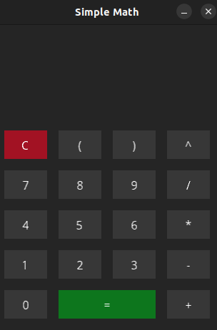

# Simple Math


Simple Math is a basic interactive calculator that uses the [Shunting-yard algorithm](https://en.wikipedia.org/wiki/Shunting-yard_algorithm) to evaluate mathematical expressions. The project is built using the MonoGame Framework and can be run in both in MonoGame app mode and a Terminal app mode.

### MonoGame app mode



### Terminal app mode

```bash
Pass in a math expression: 3 + 3
6
Press q and then ENTER to quit
Pass in a math expression: This should be invalid
Invalid input (ノ﹏ヽ)
Press q and then ENTER to quit
Pass in a math expression: q
Bye | (• ◡•)| (❍ᴥ❍ʋ)
```

## Ubuntu Prerequisites

Before you can build and run Simple Math, you need to have the following installed on your system:

1. [.Net Core SDK](https://dotnet.microsoft.com/download)
2. [Make](https://www.gnu.org/software/make/)

## Build and Run

To build and run the project in MonoGame app mode, run:

```bash
$ make
```

To build and run the project in Terminal app mode, run:

```bash
$ make OPT=terminal
```

## Running Tests

To run the test suite for Simple Math, use the following command:

```bash
$ make test
```
